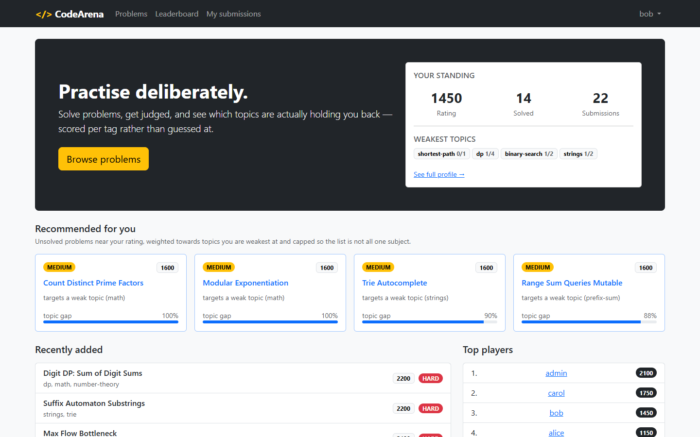
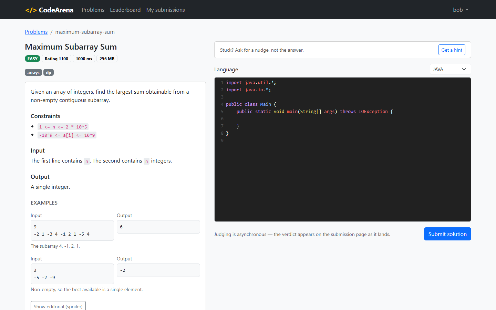
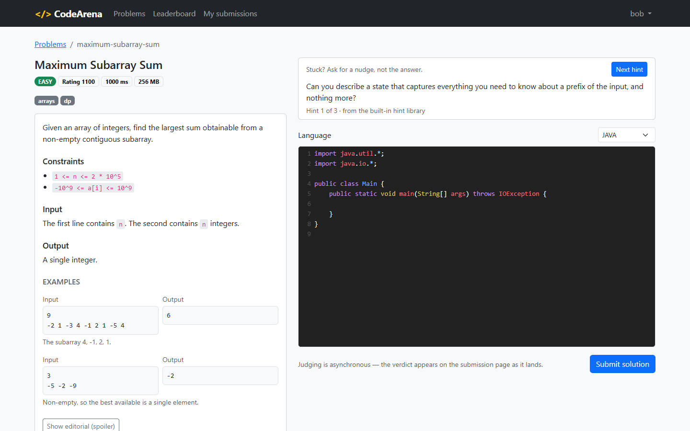
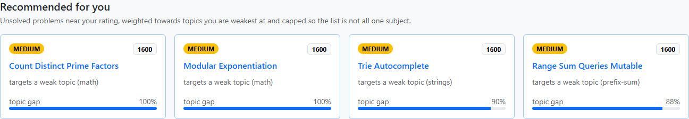
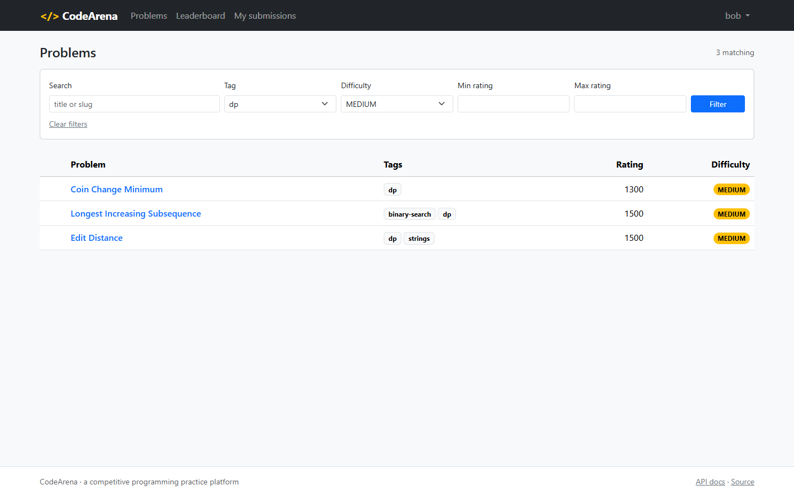
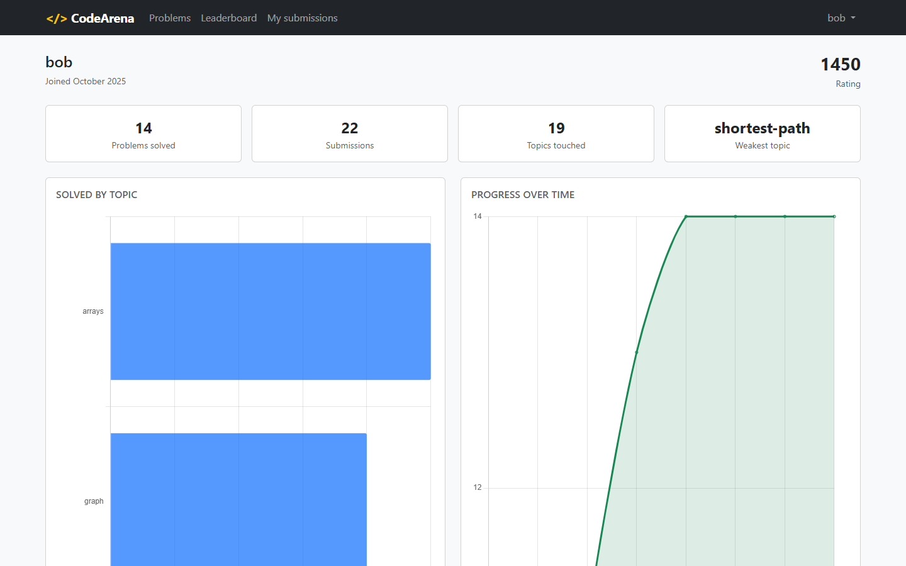
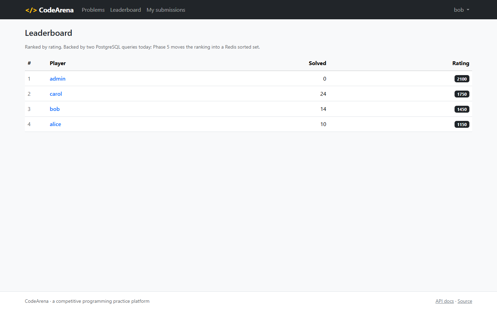
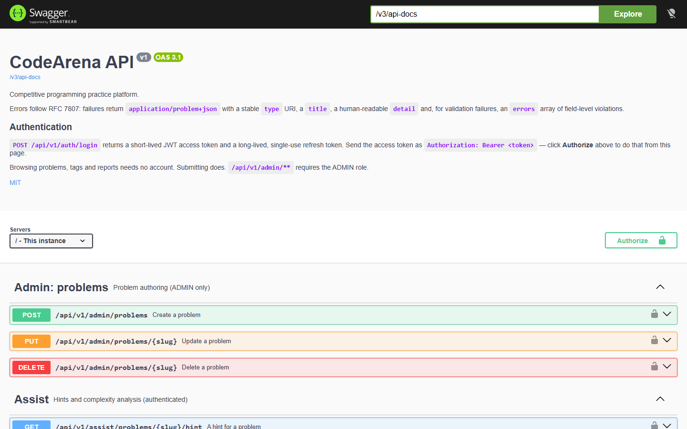

# CodeArena

[](https://github.com/amkjitu/jjudge/actions/workflows/ci.yml)
[](https://adoptium.net/)
[](https://spring.io/projects/spring-boot)
[](LICENSE)

A competitive-programming practice platform: browse problems, submit solutions, get
asynchronously judged verdicts, climb a leaderboard — and get told *what to solve next* by a
recommendation engine that models your per-topic proficiency.

> **Status: complete.** A versioned REST API with RFC 7807 errors and OpenAPI docs; JWT and
> OAuth2 authentication with rotating refresh tokens and per-user rate limiting; a
> server-rendered Thymeleaf UI with a CodeMirror editor and Chart.js progress charts; a
> recommendation engine with a Redis-backed leaderboard; an async judging pipeline over Kafka
> with live verdicts over SSE; a sandboxed judge that really compiles and runs Python, C++ and
> Java in a locked-down container; MongoDB-backed problem statements and a source archive; and an
> `arena-ai` service for hints and complexity analysis that degrades to static analysis when no
> model is reachable. Seven containers, one `docker compose up`, and CI that judges a submission
> end to end. What each phase added is in [Roadmap](#roadmap).



**Try it in one command.** No demo is hosted — this stack is seven containers and a hosted
instance would be a bill rather than a portfolio piece, so it runs on your machine instead:

```bash
docker compose up -d --build
```

Then open <http://localhost:8080/> and sign in as `bob` / `Password123!`. The seeded accounts
(`alice`, `bob`, `carol`, `admin`) have deliberately different skill profiles, so the
recommender produces visibly different output for each. Credentials for a throwaway local
database — not secrets.

---

## Table of contents

- [Why this project](#why-this-project)
- [Architecture](#architecture)
- [Tech stack](#tech-stack)
- [Data model](#data-model)
- [The recommendation algorithm](#the-recommendation-algorithm)
- [Getting started](#getting-started)
- [API](#api)
- [Security](#security)
- [Web UI](#web-ui)
- [Redis](#redis)
- [MongoDB](#mongodb)
- [arena-ai](#arena-ai)
- [The judging pipeline](#the-judging-pipeline)
- [Real judging](docs/REAL-JUDGE.md)
- [Testing](#testing)
- [Project structure](#project-structure)
- [Roadmap](#roadmap)
- [License](#license)

---

## Why this project

Most portfolio backends are a CRUD app with a login screen. This one has a genuine algorithm
at its centre — a recommender with a documented scoring function, a bounded-heap top-N
selection, and a topologically sorted prerequisite graph — plus an async event pipeline that
actually needs a message broker rather than having one bolted on for show.

---

## Architecture

```
                    ┌────────────────────┐
   Browser  ───────▶│   arena-api        │  Spring Boot (web + REST)
   (Thymeleaf UI)   │   Security / JWT   │
                    │   JPA  ├─▶ Postgres│  users, problems, submissions, stats
                    │        ├─▶ MongoDB │  statements, editorials, source code
                    │        └─▶ Redis   │  leaderboard cache, rate limits
                    └────────┬───────────┘
                             │ publish  SubmissionCreated
                             ▼
                        ┌─────────┐
                        │  Kafka  │
                        └────┬────┘
                             │ consume
                    ┌────────▼───────────┐
                    │  arena-judge       │  runs the code in a sandboxed container,
                    └────────┬───────────┘  or simulates when that is switched off
                             │ publish  VerdictAssigned  ──▶ back to arena-api ──▶ SSE
                    ┌────────────────────┐
                    │  arena-ai          │  Spring AI: hints, complexity analysis
                    └────────────────────┘
```

Four Maven modules: `arena-common` (shared enums and event contracts), `arena-api`,
`arena-judge`, `arena-ai`.

---

## Tech stack

| Area | Choice |
|---|---|
| Language / runtime | Java 17, Spring Boot 3.5.16 |
| Build | Multi-module Maven, Maven Wrapper (`./mvnw` — no local Maven needed) |
| Relational data | PostgreSQL 16, Spring Data JPA, Hibernate 6, Flyway migrations |
| Document data | MongoDB 7 — problem statements and submission source archive |
| Cache / ranking | Redis sorted sets for ranking, Lua token bucket for rate limiting |
| Messaging | Apache Kafka in KRaft mode, JSON events, at-least-once with idempotent consumers |
| Security | Spring Security 6, BCrypt, HS256 JWT access tokens, rotating opaque refresh tokens, OAuth2 Google |
| Web UI | Thymeleaf, Bootstrap 5, CodeMirror, Chart.js — served as WebJars, no CDN |
| AI | Spring AI with Ollama, provider-configurable to OpenAI; static-analysis fallback when no model is reachable |
| API | Versioned `/api/v1`, MapStruct DTO mapping, Bean Validation, RFC 7807 errors |
| API docs | springdoc-openapi at `/swagger-ui.html` |
| Testing | JUnit 5, AssertJ, Mockito, Testcontainers |
| Infra | Multi-stage Docker builds, Docker Compose, GitHub Actions |

---

## Data model

**PostgreSQL** (owned by Flyway, `arena-api/src/main/resources/db/migration`):

| Table | Purpose |
|---|---|
| `users` | credentials, role, Elo-style `rating` |
| `problems` | title, slug, difficulty bucket, numeric `rating`, limits |
| `tags` | topic taxonomy (30 tags) |
| `problem_tags` | problem ↔ tag many-to-many |
| `tag_prerequisites` | directed edges of the prerequisite DAG over tags |
| `submissions` | one row per attempt: language, status, verdict, runtime, how it was judged |
| `user_tag_stats` | denormalised per-user, per-tag solved/attempt counters |
| `refresh_tokens` | hashed, revocable refresh tokens with rotation lineage |

Design notes worth calling out:

- **Enums are `varchar` + `CHECK`, not native PG enums.** Adding a value stays an ordinary
  migration instead of an `ALTER TYPE` that cannot run inside a transaction.
- **`submissions` has a cross-column check**: a verdict exists *exactly when* status is
  `DONE`. The illegal intermediate state is unrepresentable rather than merely discouraged.
- **`user_tag_stats` counts attempts per *problem*, not per submission.** Five failed
  submissions on one problem is one attempt — otherwise `solved / attempts` would measure
  stubbornness rather than proficiency.
- **Hibernate runs with `ddl-auto: validate`.** Any drift between entity mappings and the
  Flyway schema is a startup failure, which makes every integration test a mapping test too.

**MongoDB**: `problem_statements` (Markdown statement, editorial, worked examples, keyed by slug), `submission_sources` (source code, keyed by the PostgreSQL submission id).
**Redis**: `leaderboard:global` sorted set, `ratelimit:submissions:*` token buckets.

### Seed data

Migrations `V2`–`V5` seed 30 tags with their prerequisite edges, 40 problems spanning ratings
800–2200, and three demo users with deliberately different skill profiles so the recommender
produces visibly different output for each:

| User | Password | Rating | Profile |
|---|---|---|---|
| `admin` | `Admin123!` | 2100 | ADMIN role |
| `alice` | `Password123!` | 1150 | strong on arrays/strings, bounces off dp and graphs |
| `bob` | `Password123!` | 1450 | broad coverage, repeatedly fails dp and shortest-path |
| `carol` | `Password123!` | 1750 | strong nearly everywhere, weak on geometry |

These are demo credentials for a throwaway local database — not secrets.

`user_tag_stats` is *derived* in SQL from the seeded submissions rather than hand-written, so
the counters cannot drift from the history that justifies them. A test re-derives them and
asserts zero difference.

---

## The recommendation algorithm

The centrepiece. Given a user, return the *N* problems they should attempt next — and be able
to say why.

The whole engine is **framework-free**: `RecommendationEngine`, `ProblemScorer`,
`PrerequisiteGate` and `TagProficiency` take plain values and know nothing about Spring, JPA or
HTTP. `RecommendationService` is the only place the algorithm and the database meet. That is
what makes it practical to test the scoring behaviour exhaustively instead of incidentally.

### 1. Tag-proficiency vector

For each topic, `proficiency = solved / (attempts + k)` with `k = 3`. The `+ k` is a Bayesian
pseudo-count: it stops "1 solved out of 1" outranking "18 solved out of 20".

Counts are carried through rather than a precomputed ratio, because **ranking and gating ask
different questions of the same data** — see the [gate](#3-prerequisite-gate).

### 2. Candidate pool

Unsolved problems with `rating ∈ [userRating − 100, userRating + 200]`, filtered in SQL so the
pool is small before any scoring happens. The band is asymmetric on purpose: growth comes from
stretching upwards, not from revisiting easier ground.

### 3. Prerequisite gate

A topic is blocked when a prerequisite was **demonstrably not learned**, or when a prerequisite
is itself blocked. Blocking propagates: fail `arrays` and `segment-tree` disappears too.

**Why a topological sort.** Readiness is transitive. Answering "is this topic ready?" per topic
means walking the ancestor chain each time — O(V·E), and awkward to terminate on a malformed
graph. Processing topics in dependency order means every prerequisite is already decided when a
topic is reached, so the entire readiness map falls out of **one O(V + E) pass** with no
recursion and no repeated work. Kahn's algorithm; a cycle degrades to unordered rather than
silently dropping topics.

**Demonstrably matters.** Two conditions are required: a raw success rate below the floor,
*and* enough attempts for that rate to mean anything. Absence of evidence is not evidence of
absence — and getting this wrong is not a subtle mis-ranking:

> The first version gated on the *smoothed* proficiency. That scores 1-solved-of-1-attempted at
> `1/(1+3) = 0.25`, below the 0.34 floor — so a **perfect record read as a failure**. On the
> root topic `implementation` that verdict cascaded to every descendant, and `bob` got **2**
> suggestions instead of 10. Smoothing is right for ranking and wrong for thresholding.

The gate also stands down entirely rather than returning an empty list: an empty panel is a
worse answer than a slightly-too-hard problem.

### 4. Scoring

```
score = w₁·tagWeakness + w₂·ratingFit + w₃·recency − w₄·repetitionPenalty
        0.45            0.35           0.10         0.30
```

Every term is normalised to **[0, 1] before weighting**. That is the point of the
normalisation: it makes the weights directly comparable, so "weakness matters more than
recency" is expressed by `0.45 > 0.10` rather than by an accident of units.

| Term | Shape | Why |
|---|---|---|
| `tagWeakness` | mean of `1 − proficiency` across the problem's topics | The **mean, not the minimum** — taking the weakest tag would score every multi-topic problem as maximally urgent the moment it touched one unfamiliar area |
| `ratingFit` | Gaussian centred at `userRating + 100`, σ = 120 | Peaks *above* the user: recommending what you can already do is comfortable and useless. Gaussian rather than linear because 30 points off target is nearly as good and 400 points off is the wrong problem — one function cannot express both linearly |
| `recency` | `0.5 ^ (ageDays / 180)` | Half-life, so an old problem is mildly less attractive rather than disqualified. Never reaches zero |
| `repetitionPenalty` | `n / (n + 2)` | Candidates are unsolved, so attempts are failures. Saturating, so the tenth failure does not drown out every other term |

All four components are returned in the API response. A recommender that cannot explain itself
is indistinguishable from a shuffle.

### 5. Top-N selection — the bounded min-heap

A `PriorityQueue` of capacity *K*, ordered by score **ascending**, so its root is always the
weakest of the best *K* seen so far. Each candidate is compared against that root in O(1) and
inserted — O(log K) — only if it would displace it.

```
sorting the pool    O(M log M) time, O(M) extra memory
bounded heap        O(M log K) time, O(K) extra memory
```

For the seeded catalogue of 40 problems the difference is unmeasurable. The reason to write it
this way is that **M grows with the catalogue while K stays fixed at about thirty** — the gap
widens exactly as it starts to matter, and the code does not need revisiting when it does.

The heap is an optimisation, and an optimisation that changes the answer is a bug — so a test
runs it against a plain full-sort reference over **100,000 random candidates** and asserts the
two produce identical output. Ties break on problem id so the result is a total order and the
same request always returns the same list.

### 6. Diversity cap

At most 2 results may share a topic, so the list is not five flavours of DP.

**Why over-fetch first.** A heap of exactly *N* yields the top *N* by score, and the cap then
removes some of them — leaving fewer than were asked for, with nothing to backfill from.
Keeping `K = N × 3` gives the cap alternatives to promote. It is still O(M log K); the factor
sits inside the logarithm.

Selection is greedy best-first rather than optimal. Choosing the highest-scoring set satisfying
all caps is a constrained selection problem; taking them in score order and skipping breaches
is O(K·t), explainable in one sentence ("the best ones, spread out"), and no user could tell
the difference. If the cap would starve the list, skipped candidates are added back in score
order — returning eight when ten were asked for, to honour a soft preference about variety,
would be the cap overruling the request.

### Complexity

With **M** candidates, **N** requested, **t** mean tags per problem, **K = N × overfetch**,
**V** topics and **E** prerequisite edges:

| Step | Cost |
|---|---|
| Load proficiency, DAG, solved ids, attempt counts | 4 queries, independent of M |
| Prerequisite gate (Kahn) | O(V + E) |
| Gate + score every candidate | O(M · t) |
| Top-K selection | **O(M log K)** |
| Diversify | O(K log K) |
| **Total** | **O(M log K)** |

Memory is O(K), not O(M).

### Try it

The three demo accounts were seeded with deliberately different histories, so comparing their
output shows the scoring responding to input rather than sorting the catalogue:

```bash
curl -s "http://localhost:8080/api/v1/recommendations/users/bob?limit=5" | jq '.[] | {slug: .problem.slug, score, reason}'
```

---

## Getting started

### Run the stack

```bash
cp .env.example .env
docker compose up -d --build
```

Then:

```bash
curl http://localhost:8080/actuator/health
```

Postgres is exposed on `localhost:5432` (`codearena` / `codearena`) so you can inspect the
seeded data directly.

Tear down, including the database volume:

```bash
docker compose down -v
```

### Turning on real judging

Submissions are judged by hash unless you ask for otherwise. To run them for real, build the
runner image once:

```bash
docker build -t codearena/arena-runner:dev arena-judge/runner
```

Then start the stack with the mode set:

```bash
ARENA_JUDGE_MODE=REAL docker compose up -d --build
```

**Do this on a machine you can rebuild, not one you care about.** The judge needs a Docker
socket to create containers, and that is equivalent to root on the host — read
[docs/REAL-JUDGE.md](docs/REAL-JUDGE.md) before enabling it anywhere that matters. On Linux the
socket is group-owned, so pass its gid too:

```bash
ARENA_DOCKER_GID=$(getent group docker | cut -d: -f3) ARENA_JUDGE_MODE=REAL docker compose up -d
```

### Deploying it publicly

[docs/DEPLOYMENT.md](docs/DEPLOYMENT.md) covers running the whole stack on one always-free Oracle
Cloud ARM machine behind HTTPS, using `docker-compose.prod.yml` and Caddy.

Two things that matter before anything is reachable from outside your laptop:

- **The seeded `admin` password is printed in this README** and grants problem CRUD. The
  production overlay sets `arena.security.seeded-accounts=locked`, which rotates it at startup
  and **refuses to start** without a replacement — a warning would scroll past in a deploy log
  and the site would simply be open.
- **The base compose file publishes Postgres, Mongo, Redis and Kafka to the host** for local
  convenience. The overlay rebinds all four to `127.0.0.1`. Note the `!override` tags in it:
  Compose *merges* list-valued keys, so without them the base file's `0.0.0.0` binding survives
  alongside the new one and the overlay closes nothing.

### Local development

No local Maven or JDK install beyond Java 17 is required — the Maven Wrapper bootstraps
Maven itself.

```bash
./mvnw clean verify
```

---

## API

Interactive docs: **<http://localhost:8080/swagger-ui.html>** (spec at `/v3/api-docs`).

| Method | Path | Auth | Purpose |
|---|---|---|---|
| `POST` | `/api/v1/auth/register` | — | Create a local account, returns a token pair |
| `POST` | `/api/v1/auth/login` | — | Exchange credentials for a token pair |
| `POST` | `/api/v1/auth/refresh` | refresh token | Rotate: consumes the token, returns a new pair |
| `POST` | `/api/v1/auth/logout` | refresh token | Revoke a refresh token (idempotent) |
| `GET` | `/api/v1/auth/me` | bearer | The caller's own profile |

| Method | Path | Purpose |
|---|---|---|
| `GET` | `/api/v1/problems` | List/filter/search, paginated |
| `GET` | `/api/v1/problems/{slug}` | Problem detail |
| `GET` | `/api/v1/problems/{slug}/submissions` | Submissions against a problem |
| `POST` | `/api/v1/submissions` | Submit a solution → `201` + `Location` |
| `GET` | `/api/v1/submissions/{id}` | One submission |
| `GET` | `/api/v1/submissions/{id}/source` | Submitted source as `text/plain` |
| `GET` | `/api/v1/submissions/me` | Calling user's history |
| `GET` | `/api/v1/users/{username}` | Profile with per-topic proficiency |
| `GET` | `/api/v1/tags` | Topic taxonomy + prerequisite DAG |
| `GET` | `/api/v1/reports/tag-difficulty` | Aggregate report — **Spring JDBC, not JPA** |
| `POST`/`PUT`/`DELETE` | `/api/v1/admin/problems[/{slug}]` | Problem authoring |

```bash
curl -s "http://localhost:8080/api/v1/problems?tag=dp&difficulty=HARD&size=3"
```

```bash
curl -s "http://localhost:8080/api/v1/reports/tag-difficulty?sort=HARDEST&minProblems=2"
```

```bash
TOKEN=$(curl -s -X POST http://localhost:8080/api/v1/auth/login -H 'Content-Type: application/json' -d '{"usernameOrEmail":"bob","password":"Password123!"}' | python -c "import sys,json;print(json.load(sys.stdin)['accessToken'])")
```

```bash
curl -s -X POST http://localhost:8080/api/v1/submissions -H "Authorization: Bearer $TOKEN" -H 'Content-Type: application/json' -d '{"problemSlug":"edit-distance","language":"JAVA","sourceCode":"class Main {}"}'
```

### Design decisions worth calling out

- **Errors are RFC 7807** `application/problem+json` with a stable `type` URI clients can
  branch on, plus an `errors` array of field-level violations. Framework failures — unreadable
  bodies, type mismatches, unknown sort properties — are reshaped into the same envelope
  rather than falling through to Boot's default error body.
- **Difficulty is never accepted from a client.** It is derived from `rating` via
  `Difficulty.fromRating`, so a problem labelled `EASY` at rating 2200 is unrepresentable.
- **Pagination has its own envelope.** Serialising Spring's `Page` directly would publish
  `Pageable`/`Sort` internals as API contract — a shape Spring itself warns is unstable.
- **Page size is capped at 100.** Without it, `?size=1000000` is free denial-of-service.
- **Services return DTOs, not entities.** See the note on `open-in-view` under
  [Testing](#a-bug-the-tests-were-hiding).
- **`ORDER BY` in the JDBC report comes from an enum, never from the request.** A bind
  variable is only legal where a *value* is expected, so a sortable column has to be
  interpolated — which makes a whitelist the only safe way to do it.

### Why one endpoint uses `JdbcTemplate`

`/api/v1/reports/tag-difficulty` is four CTEs of set-level aggregation returning a shape that
maps to no entity. It uses `FILTER (WHERE ...)`, `bool_or` and `NULLS LAST` — none of which
JPQL has vocabulary for. This is the case where dropping to SQL is simpler, faster and more
honest than bending an ORM around it, and Spring JDBC gives that up without giving up
connection management or exception translation.

One detail it gets right: an untouched tag returns `null` rates rather than `0.0`. "Nobody has
tried this" and "everybody who tried failed" are different facts and should not render alike —
which means using `ResultSet#wasNull()`, since `getDouble` silently turns SQL `NULL` into zero.

---

## Security

Two filter chains, because the API and the browser login flow want opposite things:

| Chain | Matches | Session | CSRF | Unauthenticated response |
|---|---|---|---|---|
| API | `/api/**` | stateless | off | `401` + `application/problem+json` |
| Web | everything else | as needed | on | `401`, or the OAuth2 redirect |

CSRF is disabled **only** on the stateless chain. That is safe precisely because
authentication rides in the `Authorization` header rather than a cookie — a cross-site form
post carries no credentials to forge. The browser chain keeps CSRF protection, because the
OAuth2 `state` parameter genuinely needs a session behind it.

### Access rules

| Area | Rule |
|---|---|
| Problems, tags, profiles, reports (`GET`) | public — browsing needs no account |
| Submissions | authenticated |
| `/api/v1/admin/**` | `ADMIN` — enforced by *both* the path matcher and `@PreAuthorize` |
| `/actuator/health`, `/actuator/info`, Swagger | public |
| Other actuator endpoints | `ADMIN` |

The admin rule is deliberately doubled up. Path matchers are easy to break by accident — a new
controller mapped one level up, a matcher that stops matching after a refactor — and method
security fails closed regardless of how a request was routed.

### Tokens

**Access tokens are JWTs** (HS256, 15 minutes), so authorization needs no database round trip.
Signed with a key the app refuses to start without, and validated for signature, expiry *and*
issuer — so a token minted by another service sharing the key is still rejected.

**Refresh tokens are not JWTs.** They are 256 bits of `SecureRandom`, stored as a SHA-256
digest, valid for 7 days. The reasoning: the entire point of a refresh token is that it can be
revoked, and a signed JWT cannot be — once issued it is valid until it expires no matter what
the server later decides. A database row gives you logout, rotation and reuse detection; the
access token stays stateless precisely because it is short-lived enough that revocation doesn't
matter.

SHA-256 rather than BCrypt for the digest is also deliberate: BCrypt's work factor exists to
slow brute-forcing of low-entropy human passwords, and a 256-bit random token has nothing to
brute-force. This hash runs on every single refresh.

**Rotation with reuse detection.** Every refresh consumes the presented token and issues a new
one, linked back through `replaced_by`. Presenting an already-rotated token has only one
consistent explanation — it leaked — so every live session for that account is revoked. This
costs a legitimate user one re-login in the rare genuinely-concurrent case, which is the right
side of that trade.

> **A bug this caught:** the revocation originally ran in the same transaction as the exception
> that reports it — so throwing rolled the revocation straight back, leaving the *attacker's*
> newer token live. It only shows up in a test that checks the other token afterwards. Fixed by
> running the revocation in a `REQUIRES_NEW` transaction.

### Other decisions

- **Federated accounts are matched on the provider's `sub`, never on email.** Email addresses
  get reassigned and can change; matching on them would mean anyone who could get Google to
  issue a token for an address equal to an existing account's email would take that account
  over. A Google identity whose email already belongs to a local account is refused rather than
  silently linked.
- **The database enforces the password/provider correspondence.** `password_hash` is nullable,
  with a `CHECK` requiring it exactly when `auth_provider = 'LOCAL'`. "Federated user with a
  password nobody set" is unrepresentable, not merely unlikely.
- **The OAuth2 callback delivers the refresh token in an `HttpOnly` cookie**, not a URL
  parameter or fragment — both of those write a long-lived credential into browser history, and
  a query parameter additionally leaks through `Referer` and access logs.
- **Login does not distinguish "no such user" from "wrong password".** That difference is a free
  account-enumeration oracle. A test asserts the two responses are byte-identical.
- **Validation errors redact sensitive fields.** Echoing the rejected value is genuinely useful
  ("you sent 99999, the max is 4000") and is also how a rejected password ends up in a response
  body and every log that aggregates it. Fields matching `password`/`secret`/`token`/
  `credential` report no value, and long values are truncated.
- **Google login is optional.** With no credentials configured the application starts normally
  and simply has no Google button — Boot's own auto-configuration would instead fail at startup
  on an empty `client-id`, which is what happens when Compose passes the variable through
  unset.
- **Rate limiting is a token bucket, keyed by user.** A fixed window would let a caller spend
  the whole quota at the end of one window and again at the start of the next. Keyed by user id
  rather than IP, because IP punishes everyone behind one NAT and is trivially evaded — which
  is why it runs as an interceptor (after authentication) rather than a filter.

---

## Redis

Two uses, both chosen for something Redis does that PostgreSQL does not do cheaply.

### Leaderboard — a sorted set

PostgreSQL remains the source of truth; Redis holds the ranking, cache-aside. The win is not
"the query was slow" — with four users it was not:

- **`ZREVRANGE`** returns the top N in O(log N + M) without touching the other rows. The SQL
  equivalent orders the whole table on every page view.
- **`ZREVRANK`** answers *"what position am I?"* in O(log N). In SQL that is a window function
  over every user — the cost of finding one person's rank is the cost of ranking everybody.

Redis stores only the ranking. Solve counts come from PostgreSQL for the handful of users
actually on screen, because caching them too would mean two copies of a mutable number, free to
disagree. Any Redis failure falls back to SQL and logs a warning: a ranking is a feature of the
page, not a precondition for it.

**A rating update never populates a cold cache.** Recording a new rating with a plain `ZADD`
creates the key when it is missing, so a cold cache becomes a warm cache holding exactly one
player — and reads then find a non-empty set, conclude there is nothing to rebuild, and serve a
leaderboard of one until something evicts the key. That is strictly worse than a miss, because a
miss repairs itself. The write is skipped instead, in a
[Lua script](arena-api/src/main/resources/scripts/leaderboard-update.lua) so that the check and
the write cannot be separated by an eviction; the next read repopulates from PostgreSQL, which
already holds the new rating. This one only appeared end to end, with a real verdict landing
against a cache that had just been cleared.

### Rate limiting — a token bucket in Lua

The same token-bucket algorithm as the in-process limiter it replaces, because swapping where
state lives should not change how the limiter behaves. What changes is that the limit now counts
once for the whole deployment rather than once per JVM — an in-process limiter behind two
replicas permits twice the configured rate.

The refill-and-consume step is a **Lua script**, not a sequence of commands. Separate GET/SET
round trips would let two concurrent requests read the same token count and both spend it, so
the limit would leak under exactly the load it exists to control. A script is Redis's unit of
atomicity.

Time comes from `redis.call('TIME')` rather than from the application. With several replicas the
callers' clocks disagree, and a bucket refilled against a fast clock hands out free tokens; the
server is the one clock every replica already shares.

**Fail-open on Redis outage**, deliberately. This limiter protects the judge queue from
enthusiasm, not the application from attack — turning every submission into a 429 during a cache
outage would convert a degraded cache into a total outage of the product's main action. A
limiter guarding authentication or payment would warrant the opposite choice.

---

## MongoDB

Two collections, both holding data that does not want to be in a relational row.

### `problem_statements`

A problem has two halves with nothing in common. The relational half — id, slug, rating,
difficulty, tags — is small, uniform, and read by every listing, filter and recommendation pass.
The prose half is kilobytes of Markdown, read only when one problem is opened, and genuinely
variable in shape: three worked examples or none, an editorial or not.

Modelling the prose relationally means either nullable columns nobody fills or a join table per
optional section. Splitting it keeps the hot table narrow. That — not "MongoDB is faster", which
for this data it is not — is the argument.

The slug is the `_id`: already the public identifier, already unique in PostgreSQL, and already
the value the detail page holds.

**Seeding is an upsert on every start, not a run-once migration.** MongoDB has no schema to
version, so the useful property is not "applied exactly once" but "ends up in a known state".
Re-running is harmless, editing a statement and restarting picks the change up, and a
half-finished first run repairs itself. Statements the seeder does not recognise are left alone.

Statements render server-side through commonmark with **`escapeHtml(true)` and
`sanitizeUrls(true)`**. The second is the one that is easy to miss: escaping raw HTML does
nothing about link *destinations*, which are Markdown's own syntax and go into an `href`
verbatim — so `[click](javascript:alert(1))` survives an escaping renderer intact. The template
uses `th:utext`, which escapes nothing, so both defences have to be in the renderer. A test
asserts each separately; the first version of that test passed while the second hole was open.

### `submission_sources`

Source code is an opaque blob: never queried, filtered or joined on. In the `submissions` row it
would bloat every read the leaderboard and recommender perform. The PostgreSQL submission id is
the `_id`, which gives the lookup a primary-key index for free and makes writes idempotent — a
retried store after a network blip overwrites rather than leaving a second copy.

**A failed archive write does not fail the submission.** The source reaches the judge inside the
Kafka event, so a submission whose archive write failed is still judged and still scored. Rolling
the submission back would let a document store decide whether the platform accepts work. What is
lost is later retrieval, which the endpoint already reports as a 404.

Without MongoDB configured the application still starts, backed by a bounded in-memory LRU that
says so at startup. The port exists so that choice is a wiring detail rather than something
`SubmissionService` knows about.

---

## arena-ai

Hints and complexity analysis, over Spring AI's `ChatClient`. Nothing downstream depends on
Ollama: switching to OpenAI is a starter swap plus configuration, with no service, prompt or
controller changes. That is the argument for taking the framework abstraction rather than
calling an HTTP API directly — the provider is a deployment decision, not an architectural one.

### It works with no model at all

**No Ollama container is included, deliberately.** A model worth asking is several GB resident —
more than the rest of the stack combined — and a project nobody can run without that is a project
nobody runs. So the service answers from static analysis when no model is reachable, and every
response carries a `source` of `MODEL` or `HEURISTIC`.

That field is not decoration. A heuristic estimate presented as if a model had reasoned about
your code is worse than no estimate: the reader calibrates their trust on the label, and a wrong
label spends credibility it did not earn. The fallback is a feature, so it is stated.

The model call is bounded by a timeout and falls back on expiry. `ChatClient` blocks, and a local
model under memory pressure can block for a very long time — without the bound, a request thread
is held hostage by a dependency the response does not actually need.

### The static analyser

Complexity analysis is undecidable in general; a loop's bound can depend on a runtime value. What
*is* recognisable is the handful of shapes that account for most competitive-programming
solutions:

| Signal | Effect |
|---|---|
| Loop nesting depth *k* | O(n^*k*) |
| A sort | at least O(n log n) |
| An interval that halves (`mid = lo + (hi - lo) / 2`, `lower_bound`) | a log factor |
| A function whose body calls its own name | recursion, bound not measured |
| Hash container, or allocation sized by input | O(n) space; with two loop levels, O(n²) |

Comments and string literals are stripped first — without that, the word `for` in a printed
message counts as a loop, which is exactly the kind of error that makes a tool untrustworthy.
Nesting is found by tracking brace depth, and by indentation for Python, which has no braces.

**Every estimate carries its reasoning and a caveat naming the most likely way it is wrong.** The
known-wrong cases are asserted in tests rather than ignored: a two-pointer sweep is genuinely
linear but structurally a loop inside a loop, so it is over-estimated as quadratic and says so.
A heuristic that quietly changes which cases it gets wrong is one nobody can rely on.

### Hints are nudges, not solutions

Requested by level: 1 asks how to approach the problem, 3 may name the technique. The system
prompt forbids code and pseudocode outright, because models are obliging by default and will
write the whole solution given the chance — quietly turning a practice platform into an answer
key. Someone who wants the answer can open the editorial, which is on the page behind a spoiler.

Without a model, hints come from a library written per *technique* rather than per problem, which
is the right granularity: "what subproblem would let you extend a solution by one element?" is
the right nudge for every dynamic-programming problem on the platform. A test asserts that no
library hint contains code.

### Two ways in, for one reason

`arena-ai` has no authentication and its port is not published. Its only client is `arena-api`,
which authenticates the user first; adding a second token scheme would mean two places to get
authentication wrong for a decision already made correctly upstream.

Inside `arena-api` the hint is reachable twice — `/api/v1/assist/...` for API clients and
`/problems/{slug}/hint` for the page. That duplication is not an oversight: the two security
chains authenticate differently, and a `fetch` from a logged-in page carries a session cookie and
no bearer token, so it is anonymous against the stateless `/api/**` chain. The alternatives were
weakening that chain to accept cookies or minting a token into the page for JavaScript to hold.
A second route on the chain the browser is already authenticated against is the cheaper answer.

---

## The judging pipeline

Submitting returns in milliseconds; judging happens somewhere else entirely.

```
POST /api/v1/submissions
        │ insert row (QUEUED), commit
        ▼
  arena.submissions ──────────────▶ arena-judge
   (keyed by submission id)          20 test cases on a thread pool
        ▲                                    │
        │                                    ▼
   arena-api ◀────────────────────── arena.verdicts
   apply verdict, update tag stats,
   award Elo, push SSE ──────────▶ browser updates in place
```

### Ordering and delivery

Both topics are **keyed by submission id**. Every message about one submission therefore lands
on one partition and is processed in order by a single consumer — without that, two workers
could judge the same submission concurrently and race to write conflicting verdicts.

Delivery is **at-least-once**: the listener processes a record to completion before returning,
so the offset is committed after the work is durable rather than before it starts. The cost of
that choice is duplicates, which is why `VerdictService.apply` is idempotent — a redelivered
message would otherwise award the rating and the tag counters twice. There is a test for exactly
that, because it is the failure that would never show up in manual testing.

### Three ordering hazards, and what was done about them

- **Publishing inside the transaction would race the commit.** The judge is fast enough to
  consume, judge and publish a verdict before the API's own transaction commits — so the verdict
  listener would look for a row that does not exist yet and drop it, leaving the submission
  QUEUED for ever. The event is published on `afterCommit` instead. The residual risk is the
  other direction (committed but not published); the honest fix is a transactional outbox, which
  is noted in the code rather than pretended away.
- **A thread pool per record would break at-least-once.** Handing each record to an executor and
  returning immediately lets Kafka commit the offset while the work is still running, so a crash
  mid-judge loses the submission silently. Parallelism across submissions comes from consuming
  multiple partitions; the thread pool inside the judge overlaps the *test cases* of one
  submission, which is independent work with no delivery guarantee riding on it.
- **The default error handler retries for ever.** One unprocessable record and the partition
  never advances — every submission behind it stuck, with nothing but a repeating log line.
  Both consumers retry twice then move on, and treat a deserialization failure as immediately
  fatal since it will never succeed.

### Why the source code travels in the event

The usual advice is to send a reference and let the worker fetch the code from shared storage.
That would make arena-judge depend on MongoDB, which is a coupling worth paying for at a scale
this does not have: bounded by the 64 KiB cap the submission endpoint already enforces, the
payload sits comfortably inside Kafka's 1 MB default.

It also removes a race. The archive write and the publish are not one atomic operation, so a
worker fetching by reference could arrive before the document was visible — a failure that only
shows up under load. Sending the code means the worker has everything it needs the moment the
record lands, and the MongoDB write is purely for the archive.

### Judging: two modes, and the verdict says which one ran

The judge has a real mode and a simulated one, and **it defaults to simulated**.

**`ARENA_JUDGE_MODE=REAL`** compiles and runs the submission against real test cases in a
locked-down container — `--network none`, read-only root, capped memory with swap disabled, a PID
ceiling, a CPU quota, no capabilities. Python, C++ and Java. The full design, including the trust
boundary it does *not* cross, is in **[docs/REAL-JUDGE.md](docs/REAL-JUDGE.md)**.

It is off by default because creating containers needs a Docker socket, and **access to a Docker
socket is equivalent to root on the host**. The sandbox protects the machine from the submitted
code; it does not protect the machine from the judge. That is a fine trade on a throwaway VM and
a bad one on the box also serving the site, so the choice is explicit rather than a default.

**Simulated mode** derives the verdict from a hash of the submission — no `Random`, no clock. It
is what makes an end-to-end test able to assert an exact verdict instead of retrying until it
sees one, and it is why the stack is safe to expose publicly: there is no untrusted execution in
it anywhere. Obvious tells are checked before the hash, so `while (true)` reliably times out and
an empty body reliably fails to compile. It says nothing about whether the code is correct.

Real mode also falls back to simulation for a problem with no test cases, so both can occur in
one deployment. **Which one produced a verdict travels with it** — on the `VerdictAssigned`
event, in `submissions.judged_by`, on the API response, and as a badge on the submission page:

> `AC` `Executed` — compiled and run against the problem's test cases
> `WA` `Simulated` — this problem has no test cases; the verdict is a hash

Storing the verdict without it was the actual bug. A simulated `WA` and an earned one are the
same two characters in the same column, and the reasonable assumption on seeing one is the
stronger of the two. The column is nullable and rows that predate it are left `NULL` — "not
recorded" is the truth, and backfilling a value would be inventing history.

#### What the clock measures

A time limit describes an *algorithm*, and it is written against C++. Two costs were being
charged to submissions that are not theirs:

- **The judge's own round trip.** Each test case is a `docker exec`. Opening a session times
  `/bin/true` in the same container three times and takes the **minimum** — the floor is the real
  cost, anything above it is host contention — and subtracts that from every case.
- **Runtime startup.** A JVM costs a few hundred milliseconds before `main`. Each language
  carries a multiplier: C++ ×1, Java ×2, Python ×3.

Before this, a correct Java solution was marked `TLE` at 2016 ms against a 2000 ms limit, having
spent 1.7 s of it starting the JVM. A wrong `TLE` is the worst verdict a judge can produce: it is
confident, it is specific, and it sends someone to optimise code that was never slow.

### Live updates over SSE

One-directional, low-volume traffic: the server has something to say, the browser has nothing to
send back. SSE is plain HTTP, reconnects by itself, and needs no proxy configuration — a duplex
protocol would be more machinery for a smaller problem.

**Known limitation, stated rather than hidden:** emitters live in one JVM's heap, so with several
API replicas a verdict consumed by one instance cannot reach a browser connected to another. The
page falls back to a slow poll, and the real fix is fanning verdicts out over Redis pub/sub.

### What a verdict updates

Applying a verdict is where the recommender's inputs are maintained. If `user_tag_stats` stopped
being updated here, the engine would quietly degrade into "sort the catalogue by rating".

- The submission's status, verdict and runtime.
- `user_tag_stats`, per **problem** rather than per submission — the third failed attempt at one
  problem is not a third attempt at the topic. One `INSERT ... ON CONFLICT` covers every tag of
  the problem.

  The upsert proposes `GREATEST(:attemptDelta, :solvedDelta)` rather than the raw attempt delta,
  because **PostgreSQL evaluates `CHECK` constraints on the row an `INSERT` proposes, before it
  detects the conflict and switches to `DO UPDATE`.** Solving a problem that was already
  attempted sends `(solved +1, attempt +0)`, and the literal proposal `(1, 0)` violates
  `attempt_count >= solved_count` and is rejected outright — even though the update it would
  have performed was perfectly legal. Every accepted resubmission failed this way, reporting a
  constraint error about counts that were never going to be stored. The `DO UPDATE` branch reads
  the parameters directly instead of `EXCLUDED`, so the widened count does not leak into rows
  that already have real history.
- The user's rating, on a **first solve only**, by Elo against the problem's rating: a hard
  problem is worth more than an easy one. Failures cost nothing on purpose — a practice platform
  that punishes attempting hard problems trains people to avoid them.
- The Redis leaderboard entry.

---

## Testing

| Command | What runs | Needs Docker |
|---|---|---|
| `./mvnw test` | unit and web-slice tests (`*Test`) — 170 tests | no |
| `./mvnw verify` | unit **and** integration tests (`*IT`) — 318 tests | yes |

Integration tests use Testcontainers against a real PostgreSQL 16 image — never H2 — so
migrations, `CHECK` constraints, `FULL OUTER JOIN` and Postgres-specific SQL are all exercised
as they run in production. A single container is shared across the whole suite via the
singleton-container pattern rather than started per test class.

Three layers, each testing something the others cannot:

| Layer | Style | What it proves |
|---|---|---|
| Unit | plain JUnit + Mockito | business rules — difficulty derivation, tag resolution, proficiency smoothing, LRU eviction |
| Algorithm | plain JUnit, no Spring at all | the recommendation engine: scoring shape, gating, heap equivalence at 100k candidates |
| Web slice | `@WebMvcTest`, mocked services | the HTTP contract — status codes, JSON shape, error envelope |
| UI slice | `@WebMvcTest` rendering real Thymeleaf | that every page renders, forms carry a CSRF token, and output is escaped |
| Full stack | `@SpringBootTest` + Testcontainers | the Specification SQL, entity graphs, DB constraints, the real security chain, real session semantics |

Authorization tests are deliberately weighted towards the **negative** cases. A test proving an
admin can create a problem says nothing about whether everyone else can too, and that second
question is the one that matters.

### A bug the tests hid, and one they caused

Two failures from this project worth keeping, because neither was a typo.

**The engine returned 2 suggestions instead of 10.** The prerequisite gate judged mastery using
the *smoothed* proficiency, which scores 1-solved-of-1-attempted at 0.25 — below the 0.34 floor.
A perfect record read as a failure, and on the root topic `implementation` that verdict cascaded
through the entire taxonomy. The fix was recognising that ranking and gating are different
questions: ranking wants smoothing, gating wants the raw ratio plus a minimum-evidence
requirement. The regression test is named after the symptom.

**A test-infrastructure hiccup destroyed the fixtures.** `AbstractApiIT` undoes each test's
writes by deleting rows above an id watermark recorded in `@BeforeEach`. JUnit runs `@AfterEach`
even when `@BeforeEach` throws — so when a Redis connection failed during setup, the watermark
stayed at its default of zero and `DELETE ... WHERE id > 0` emptied the seeded tables that every
other test depends on. One unrelated failure took out sixteen tests.

Both fixes are small and both are the kind that only exist once you have seen the failure: the
watermark now starts at a sentinel that cleanup refuses to act on, and it is recorded before
anything that can fail.

### A bug the tests were hiding

The API integration tests were originally `@Transactional`, the usual way to get rollback
isolation. They all passed. The API then returned **HTTP 500** on `GET /api/v1/problems` the
first time it was exercised against the running container.

The cause: `spring.jpa.open-in-view` is disabled, so the persistence session closes when the
service method returns. Mapping an entity's lazy `tags` collection in the controller therefore
throws `LazyInitializationException` — except in a test, where the test's own transaction keeps
a session open for the whole request and the lazy load quietly succeeds.

Two changes came out of it:

1. **Services return DTOs, not entities.** Mapping happens inside the transaction, so the
   transaction boundary and the "what is loaded" boundary are the same line of code.
2. **`AbstractApiIT` is no longer `@Transactional`.** The tests now run with production session
   semantics and undo their own writes by id watermark instead. The trade-off is that a test
   must create whatever it intends to mutate rather than editing seeded rows — which is worth
   it to stop the suite lying about what production does.

What the suite covers:

- every Flyway migration applies successfully, in order
- seeded catalogue invariants: every problem tagged, every tag used, difficulty label agrees
  with numeric rating
- `user_tag_stats` re-derived from submissions matches the stored rows exactly
- the `tag_prerequisites` graph is acyclic — Kahn's algorithm must consume every node
- entity-graph fetching, pagination, composite keys and JPA auditing round-trip correctly
- database-level uniqueness is genuinely enforced, not just checked in Java
- proficiency smoothing behaviour, including the `0/0` case that would otherwise be `NaN`
- LIKE wildcards in a search term are escaped — searching `%` matches nothing, not everything
- the page-size cap is applied, and an unknown `?sort=` property is a 400 rather than a 500
- the reporting SQL's null semantics: untouched tags report `null`, not `0.0`
- `?sort=DROP TABLE users` is rejected before it can reach the query
- the full token lifecycle against real signing and decoding: login → bearer call → rotate →
  replay the rotated token → every session dies
- a forged signature, a foreign issuer and an expired token are each rejected
- registration never echoes the password back, in success *or* validation responses
- a refused admin write genuinely did not happen — asserted by reading the row back
- the bounded heap returns **exactly** what a full sort would, over 100,000 random candidates
- the prerequisite gate stays inert for a newcomer and sharp for a user with real history
- the diversity cap holds, and backfills rather than silently returning fewer than requested
- Redis sorted-set ranking and the Lua token bucket, against a real Redis rather than a mock
- the pipeline in both directions against a real broker: what the API publishes is what the
  judge expects, and a published verdict is applied to the row
- a duplicate verdict changes nothing — the failure at-least-once delivery guarantees you
- an orphan verdict does not stall the partition; the consumer survives and handles the next
- judging is deterministic, so an end-to-end test can assert an exact verdict
- a verdict records whether it was executed or simulated, and an event from before that field
  existed leaves it unknown rather than claiming the code was run
- the sandbox holds under attack: a fork bomb, a memory bomb, a network call, a filesystem write,
  an infinite loop, a sleeping process and unbounded output each fail in the specific way they
  are supposed to. A sandbox nobody has tried to break is a claim, not a result
- every Thymeleaf page actually renders: the UI slices run the template engine and assert
  against the produced HTML, so a fragment typo fails the build rather than the demo
- submitted source is escaped, not interpreted — `<script>` comes back as `&lt;script&gt;`

---

## Web UI

Server-rendered Thymeleaf, reachable at <http://localhost:8080/>.

| Page | Path |
|---|---|
| Home / dashboard | `/` |
| Problem catalogue with filters | `/problems` |
| Problem detail + code editor | `/problems/{slug}` |
| Submission history / detail | `/submissions`, `/submissions/{id}` |
| Profile with charts | `/users/{username}`, `/me` |
| Leaderboard | `/leaderboard` |
| Admin problem CRUD | `/admin/problems` |

### What it looks like

Every image below is a capture of the running stack with the seeded data — nothing mocked up.

**Problem detail.** The statement, constraints and worked examples come from MongoDB and are
rendered from Markdown server-side; the editor is CodeMirror. The editorial sits behind a
spoiler control, because handing someone the answer next to the submit box defeats the point.



**Hints.** Levelled 1–3 and loaded on demand. The line under the hint says whether a model
produced it or the built-in library did — the reader is entitled to know which.



**Recommendations.** Each card names the reason it was chosen and how large the topic gap is.



<details>
<summary>More: catalogue, profile charts, leaderboard, API docs</summary>

**Catalogue** with tag and difficulty filters, echoed back into the form so a filtered URL is
shareable.



**Profile** — solved-by-tag and progress over time, both from the same submission history the
recommender reads.



**Leaderboard**, served from the Redis sorted set with solve counts joined on from PostgreSQL.



**OpenAPI** at `/swagger-ui.html`.



</details>

### Two authentication mechanisms, on purpose

`/api/**` is a **stateless bearer-token** chain; everything else is a **session** chain with
form login. That is not indecision — a server-rendered page has nowhere to keep a JWT that
JavaScript cannot also read, so using tokens for the UI would trade a `HttpOnly` session cookie
for an XSS-readable credential. The session chain keeps CSRF protection on precisely because
authentication rides on a cookie; the API chain disables it precisely because it does not.

Both chains resolve identity through the same `CurrentUserProvider`, so services never know
which one a request came through.

### Front-end assets are WebJars, not CDN links

Bootstrap, CodeMirror and Chart.js are Maven dependencies served from the jar. The container
renders correctly with no outbound network access, and no third party sits inside the page's
trust boundary. Versions live in the parent pom and appear in exactly one template.

### Notes worth calling out

- **The editor is progressive enhancement.** CodeMirror upgrades a real `<textarea>`; with
  JavaScript disabled the form still submits the code rather than silently posting nothing.
- **Chart data is serialised to JSON server-side**, then handed to `th:inline="javascript"` as
  a single string. Building JS array literals out of Thymeleaf loops is how XSS gets into a
  page — one tag containing a quote breaks out of the string.
- **Form-backing beans are mutable classes, not the API's records.** `th:field` has to write
  back into the object to re-populate a form after a validation failure, and a record cannot be
  written to.
- **Delete is a POST form, never a link.** A `GET` delete is one crawler away from data loss.
- **A rejected password is never re-rendered** into the registration form.

### Two bugs that only surfaced in the browser

Both passed the test suite and failed the moment the flow was walked by hand:

1. **Another user's submission returned 500, not 403.** The controller throws
   `AccessDeniedException`, and the UI advice's catch-all `Exception` handler swallowed it —
   reporting "the server broke" for what was really "not yours", and logging it at `ERROR` on
   every probe. Fixed with an explicit handler; Spring resolves by exception-type distance, not
   declaration order.
2. **A CSRF failure on a form POST returned 405.** `accessDeniedPage` *forwards*, and a forward
   preserves the request method, so the POST arrived at a `@GetMapping`-only handler. The user
   saw "Method Not Allowed" for what was really an expired session.

Both now have regression tests naming the symptom.

### Note on the IDE and `target/`

If a build fails with a `ClassNotFoundException` for a class that is plainly in `target/classes`,
or a bean whose implementation is right there "not qualifying as an autowire candidate", check
whether an IDE is compiling the same module. VS Code's Java extension writes Eclipse-compiled
classes into `target/` too, and a background rebuild can overwrite Maven's output mid-build,
leaving class files that contain `Unresolved compilation problems` and fail at *runtime*.

The build takes a directory override for exactly this:

```bash
./mvnw -Darena.build.directory=target-cli clean verify
```

### Note on Docker API versions

Testcontainers reaches the daemon through docker-java, which still negotiates Docker API
**1.32** by default. Docker Engine 25+ advertises a minimum API of **1.40** and replies to
anything older with a bare `HTTP 400` — which Testcontainers reports as the thoroughly
unhelpful *"Could not find a valid Docker environment"*, even though the daemon is running and
the CLI works fine.

docker-java reads this as a **system property**, not an environment variable, so
`DOCKER_API_VERSION` has no effect. The root `pom.xml` hands it to the forked test JVM instead:

```xml
<argLine>-Dapi.version=${docker.api.version}</argLine>
```

Override with `-Ddocker.api.version=…` if your engine needs something different.

---

## Project structure

```
.
├── arena-common/          shared enums and Kafka event contracts
├── arena-api/             web + REST + persistence
│   ├── src/main/java/com/codearena/api/
│   │   ├── ai/            HTTP client for arena-ai
│   │   ├── config/        OpenAPI, JPA auditing, Redis scripts, store selection
│   │   ├── domain/        JPA entities
│   │   ├── mongo/         @Document types, Mongo repositories, statement seeder
│   │   ├── reporting/     Spring JDBC reporting DAO
│   │   ├── repository/    Spring Data JPA repositories + Specifications
│   │   ├── service/       business logic, transaction boundaries
│   │   └── web/           controllers, DTOs, MapStruct mappers, error handling
│   └── src/main/resources/
│       ├── db/migration/  Flyway V1..V6
│       ├── mongo/         bundled problem statements
│       └── scripts/       Lua for Redis
├── arena-judge/           Kafka worker
├── arena-ai/              Spring AI service
│   └── src/main/java/com/codearena/ai/
│       ├── complexity/    static analyser + model-backed estimate
│       ├── hint/          hint library + model-backed hints
│       └── web/           controllers, DTOs, error handling
├── docs/screenshots/      README imagery
├── docker-compose.yml
└── pom.xml
```

---

## Roadmap

| Phase | Scope | Status |
|---|---|---|
| 1 | Multi-module scaffold, entities, migrations, seed data, repository tests | ✅ done |
| 2 | REST API, DTOs, validation, RFC 7807 errors, OpenAPI, `JdbcTemplate` report | ✅ done |
| 3 | Spring Security, JWT access/refresh, OAuth2 Google, rate limiting | ✅ done |
| 4 | Thymeleaf UI: Bootstrap, CodeMirror editor, Chart.js progress charts | ✅ done |
| 5 | Recommendation engine, Redis leaderboard | ✅ done |
| 6 | Kafka pipeline, `arena-judge` worker, SSE live verdicts | ✅ done |
| 7 | MongoDB statements/sources, `arena-ai` hints and complexity analysis | ✅ done |
| 8 | Full compose stack, GitHub Actions, docs, screenshots | ✅ done |
| 9 | Sandboxed judge: real execution of Python, C++ and Java behind a flag | ✅ done |

---

## License

[MIT](LICENSE)
